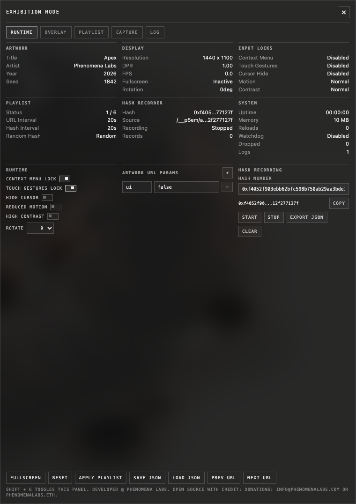
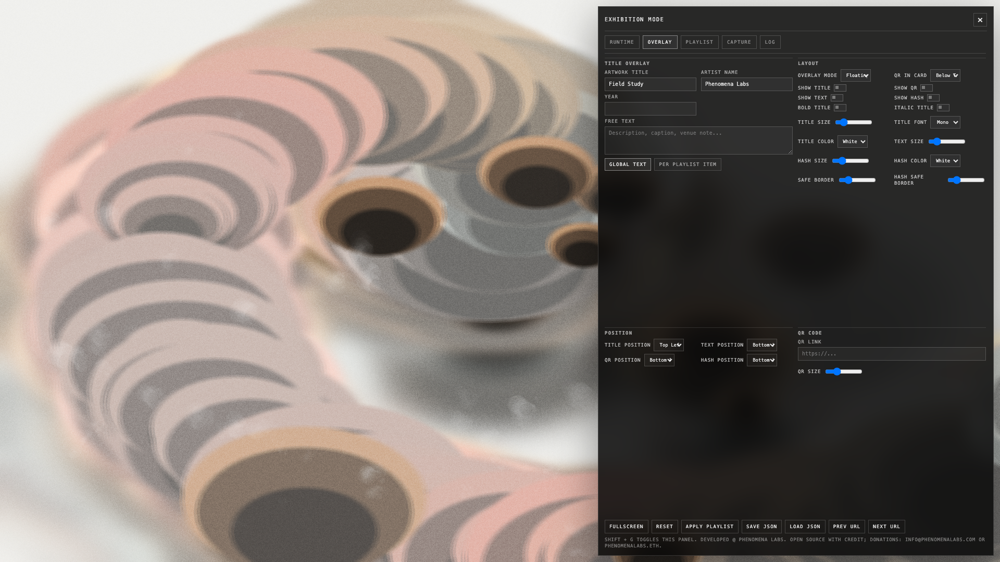
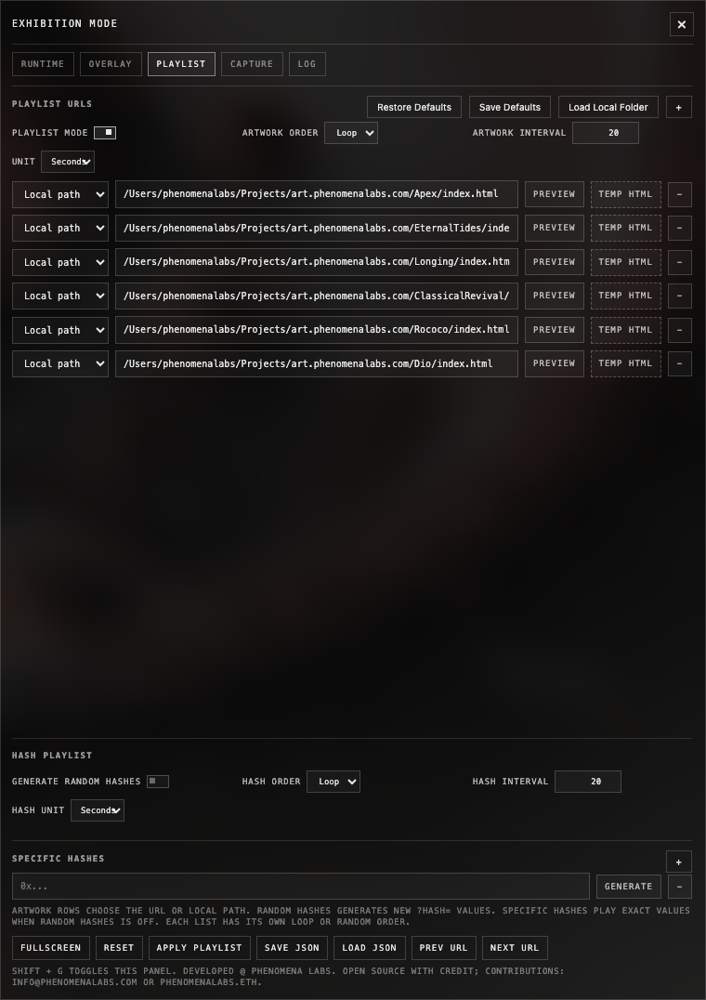

# p5 Exhibition Mode

`p5-exhibition-mode` is a small runtime layer for showing p5.js and browser-based generative artworks in real exhibition conditions.

It is meant for the moments when the artwork already exists, but the room is not behaving like the studio: the browser wants to scroll, the display is rotated, fullscreen drops, the curator needs one specific hash, the installer needs to hide an artwork UI with `ui=false`, or someone asks for a clean MP4 capture five minutes before opening.

The library adds those practical controls around the artwork without changing the artwork itself.

## What It Solves

Generative artworks are usually built for a browser, but exhibitions ask for a different kind of reliability:

- keep the work fullscreen or kiosk-ready
- suppress right-clicks, scroll bounce, pinch zoom, and browser gestures
- hide the cursor during display
- lock pixel ratio so the machine does not overload itself
- rotate the artwork for portrait screens or rotated projectors
- add a discreet title, description, QR code, or hash overlay
- rotate through artwork URLs, local files, and selected hashes
- generate new hashes at intervals for live exploration
- add artwork-specific URL params such as `ui=false`
- record the artwork canvas directly without macOS screen-capture popups
- save and reload a complete runtime setup as JSON

The runtime panel is hidden until you need it. Press `Shift + G` to open it.

## Interface

The screenshots below use made-up content and a synthetic artwork background. They show the control surface, not a bundled artwork.

### Runtime



The Runtime tab is for installation settings: fullscreen, kiosk locks, cursor behavior, display rotation, watchdog settings, diagnostics, and artwork URL params. URL params are useful when a work needs display flags that are not the seed hash, for example `ui=false` or `quality=gallery`.

### Overlay



The Overlay tab controls the exhibition label layer. You can show a title, artist, year, free text, QR code, and a small hash overlay. Floating overlays automatically stack when they share the same position, so title, text, and QR do not collide. Free text preserves line breaks from the textarea.

### Playlist



The Playlist tab separates artwork URLs/local paths from hash playback. Artwork order can loop or randomize. Hash order can also loop or randomize. If random hashes are enabled, the specific-hash section collapses and the runtime generates fresh `0x...` hashes instead.

## Install

```bash
npm install p5-exhibition-mode
```

For local development inside this repository:

```js
import { createExhibitionMode } from "./src/index.js";
```

For an installed package:

```js
import { createExhibitionMode } from "p5-exhibition-mode";
```

## Basic Usage

```js
import { createExhibitionMode } from "p5-exhibition-mode";

const exhibition = createExhibitionMode({
  title: "Spring",
  artist: "Phenomena Labs",
  year: "2026",
  fullscreen: true,
  kiosk: true,
  maxPixelRatio: 2,
  showTitleOverlay: true,
  titleOverlayPosition: "top-left",
  titleOverlayFont: "editorial",
  titleOverlayColor: "white"
});

function setup() {
  exhibition.setup();
  exhibition.applyPixelRatio();
  createCanvas(windowWidth, windowHeight);
}

function draw() {
  exhibition.tick();
  background(0);
}
```

Press `Shift + G` to open the panel.

## Local Exhibition Helper

Browsers do not let a webpage read arbitrary files from your computer. Selecting one `index.html` also does not give the browser access to neighboring JavaScript, image, shader, or data files. That is why complex local artworks often show a black screen when loaded from a raw file picker.

For a kiosk or exhibition machine, run the helper server from the folder that contains your artworks:

```bash
npx p5-exhibition-helper --root /Users/you/Artworks --port 4177
```

Then open:

```txt
http://127.0.0.1:4177/
```

Playlist entries can now use served local paths:

```txt
./ClassicalRevival/index.html
./Apex/index.html
/Users/you/Artworks/Rococo/index.html
```

If your live site is mirrored locally, point `urlMirrorRoot` at the local mirror and keep live URLs in the playlist:

```js
createExhibitionMode({
  localFiles: {
    urlMirrorRoot: "/Users/you/Projects/art.phenomenalabs.com"
  },
  playlist: {
    enabled: true,
    items: [
      "https://art.phenomenalabs.com/ClassicalRevival/index.html",
      "https://art.phenomenalabs.com/Rococo/index.html"
    ]
  }
});
```

With that setup, the helper serves the local copy as same-origin content. That matters for direct canvas capture, because browsers block pixel access to cross-origin iframes.

## Playlist And Hashes

Playlist mode can rotate artwork pages and hashes independently.

```js
const exhibition = createExhibitionMode({
  playlist: {
    enabled: true,
    itemOrder: "loop",
    intervalValue: 3,
    intervalUnit: "minutes",
    items: [
      "./works/apex/index.html",
      "https://art.phenomenalabs.com/ClassicalRevival/index.html"
    ],
    randomHash: false,
    hashOrder: "loop",
    hashIntervalValue: 30,
    hashIntervalUnit: "seconds",
    hashes: [
      "0x1111111111111111111111111111111111111111111111111111111111111111",
      "0x2222222222222222222222222222222222222222222222222222222222222222"
    ],
    hashParam: "hash"
  }
});
```

For continuous random exploration:

```js
createExhibitionMode({
  playlist: {
    enabled: true,
    randomHash: true,
    hashIntervalValue: 20,
    hashIntervalUnit: "seconds",
    items: ["https://art.example.com/field-system/index.html"]
  }
});
```

Recommended artwork behavior:

- read `?hash=` once during startup
- convert the hash string into a deterministic numeric seed
- use that seed for `randomSeed`, `noiseSeed`, or your own PRNG
- keep display flags such as `?ui=false` separate from the hash
- reload or restart the sketch when a new hash should create a new composition

Minimal p5 example:

```js
function hashToSeed(value) {
  let seed = 0;
  for (let i = 0; i < value.length; i += 1) {
    seed = (seed * 31 + value.charCodeAt(i)) >>> 0;
  }
  return seed;
}

function setup() {
  const params = new URLSearchParams(window.location.search);
  const hash = params.get("hash") || "default";
  const seed = hashToSeed(hash);

  randomSeed(seed);
  noiseSeed(seed);
  createCanvas(windowWidth, windowHeight);
}
```

If your artwork expects another parameter name, change `hashParam`:

```js
playlist: {
  randomHash: true,
  hashParam: "seed",
  items: ["https://example.com/work/?ui=false"]
}
```

## Artwork URL Params

Some artworks need custom display params. For example, Eternal Tides might need `ui=false` to hide its own interface in an exhibition.

Use `customUrlParams` in code, or add rows in the Runtime tab:

```js
createExhibitionMode({
  customUrlParams: [
    { name: "ui", value: "false" },
    { name: "quality", value: "gallery" }
  ],
  playlist: {
    enabled: true,
    randomHash: true,
    items: ["https://art.example.com/eternal-tides/index.html"]
  }
});
```

Generated URL:

```txt
https://art.example.com/eternal-tides/index.html?ui=false&quality=gallery&hash=0x1fa5259da261374fd4c92eb2df1fd6b4b1c01f5b196fa12f275dff183e4858ad
```

Custom params are applied before the hash. If the artwork URL already contains the same param name, the runtime value replaces it.

## Capture

The Capture tab records the artwork canvas and overlay layout directly at the current browser window size. It does not request screen capture, include browser chrome, or force fullscreen. Resize the browser to choose the output framing.

The default target is H.264 MP4 when the browser supports it. If the browser rejects H.264, the runtime falls back to the browser's available recorder format and reports the actual output type. WebM is still the safest long-recording fallback.

For ProRes or post-processing delivery, record first and convert locally:

```bash
p5-exhibition-capture --input exhibition-capture.webm --preset prores
p5-exhibition-capture --input exhibition-capture.webm --preset h264 --output exhibition-capture.mp4
```

ProRes is not available from browser-only `MediaRecorder`. The helper uses FFmpeg on the machine. On macOS:

```bash
brew install ffmpeg
```

Official FFmpeg downloads are listed at <https://www.ffmpeg.org/download.html>. The GitHub mirror is <https://github.com/FFmpeg/FFmpeg>.

## Runtime Panel

The panel includes:

- **Runtime:** fullscreen, kiosk locks, cursor, rotation, watchdog, diagnostics, and artwork URL params
- **Overlay:** title, free text, QR, hash overlay, safe border, font, and card/floating layout
- **Playlist:** artwork URLs/local paths, specific hashes, random hashes, loop/random order, and intervals
- **Capture:** direct canvas stills and video recording
- **Log:** runtime messages, warnings, browser errors, playlist events, and capture status

Use **Save JSON** to download the full runtime configuration. Use **Load JSON** to restore it. Use **Save Defaults** to store the current setup as the browser's restore point for that machine.

Panel settings are persisted to `localStorage` by default using `storageKey: "p5-exhibition-mode-config"`.

## Code-Only Control

Every panel control is also available through the API, so a production build can hide the panel and drive the runtime from a custom control surface, socket bridge, venue config, or remote admin page.

```js
const exhibition = createExhibitionMode({
  panel: false,
  fullscreen: true,
  kiosk: true,
  rotation: 90,
  persist: true,
  storageKey: "gallery-a-main-wall",
  playlist: {
    enabled: true,
    intervalValue: 12,
    intervalUnit: "minutes",
    randomHash: true,
    hashIntervalValue: 45,
    hashIntervalUnit: "seconds",
    items: ["./works/classical-revival/index.html"]
  }
});

exhibition
  .setup()
  .setInputLocks({ contextMenu: true, touchGestures: true, scroll: true })
  .setCursor({ hide: true, mode: "idle", idleMs: 3000 })
  .setWatchdog({ enabled: true, minFps: 12, seconds: 30, reload: true });

exhibition.setArtworkMetadata({
  title: "Classical Revival",
  artist: "Ronen Tanchum",
  year: "2026",
  showTitleOverlay: true,
  freeText: "Live generative study\nCustom edition for the south wall.",
  showFreeText: true,
  showHashOverlay: true,
  hashOverlayColor: "white",
  overlayLayout: "card"
});

exhibition.setCustomUrlParams([{ name: "ui", value: "false" }]);
exhibition.saveConfig();
```

Useful methods:

- `setFullscreen(value)`, `enterFullscreen()`, `exitFullscreen()`
- `setKiosk(value)`
- `setInputLocks({ contextMenu, touchGestures, scroll })`
- `setCursor({ hide, mode, idleMs })`
- `setRotation(degrees)`
- `setAccessibility({ reducedMotion, highContrast })`
- `setArtworkMetadata(options)`
- `setQrOptions(options)`
- `setOverlayLayout("separate" | "card")`
- `setWatchdog(options)`, `setHealthCheck(options)`
- `setPlaylistOptions(options)`, `setPlaylistItems(items)`, `setPlaylistHashes(hashes)`
- `setCustomUrlParams(params)`
- `setPlaylistIntervalParts(value, unit)`, `setPlaylistHashIntervalParts(value, unit)`
- `nextPlaylistItem()`, `previousPlaylistItem()`, `previewPlaylistUrl(url)`
- `getConfig()`, `loadConfig(config)`, `saveConfig()`, `exportConfig()`

## URL Commands

Runtime settings can be controlled from the page URL. Commands can be written directly, such as `?ui=false`, or namespaced, such as `?p5em.ui=false`.

Example kiosk launch:

```txt
http://127.0.0.1:4177/demo/?ui=false&fullscreen=true&kiosk=true&rotation=90&showTitle=true&title=Spring&artist=Phenomena%20Labs&year=2026&layout=card
```

Example playlist launch:

```txt
http://127.0.0.1:4177/demo/?playlistEnabled=true&urls=https%3A%2F%2Fart.phenomenalabs.com%2FClassicalRevival%2Findex.html%7Chttps%3A%2F%2Fart.phenomenalabs.com%2FRococo%2Findex.html&playlistInterval=40&playlistUnit=seconds&randomHash=true&hashInterval=5&hashUnit=seconds
```

Example with artwork display params:

```txt
http://127.0.0.1:4177/demo/?playlistEnabled=true&urls=https%3A%2F%2Fart.example.com%2Feternal-tides%2Findex.html&artworkParams=ui%3Dfalse%7Cquality%3Dgallery&randomHash=true
```

Common URL commands:

| Command | Values | Meaning |
| --- | --- | --- |
| `ui` / `panel` | `true`, `false` | Show the runtime panel |
| `fullscreen` | `true`, `false` | Request fullscreen after user gesture |
| `kiosk` | `true`, `false` | Enable kiosk behavior |
| `context` | `true`, `false` | Disable context menu |
| `touch` | `true`, `false` | Disable browser touch gestures |
| `scroll` | `true`, `false` | Prevent page scrolling |
| `cursor` | `true`, `false` | Hide cursor |
| `cursorMode` | `always`, `idle` | Cursor hide behavior |
| `dpr` | number | Max device pixel ratio |
| `rotation` | `0`, `90`, `180`, `270` | Rotate artwork and overlays |
| `title`, `artist`, `year` | text | Overlay metadata |
| `showTitle` | `true`, `false` | Show title overlay |
| `titleFont` | font key | Overlay font family |
| `titleColor` | `white`, `gray`, `black` | Overlay title color |
| `titlePosition` | position | Title/card position |
| `text` / `freeText` | text | Free text overlay content |
| `showText` | `true`, `false` | Show free text |
| `showHash` / `showHashOverlay` | `true`, `false` | Show small hash overlay |
| `hashPosition` | `bottom-left`, `bottom-right` | Hash overlay position |
| `hashColor` | `white`, `black` | Hash overlay color |
| `layout` | `separate`, `card` | Floating overlays or card label |
| `qr` | URL | QR link |
| `showQr` | `true`, `false` | Show QR code |
| `artworkParams` / `customParams` | `name=value|name2=value2` | Params added before hash |
| `playlistEnabled` | `true`, `false` | Enable playlist mode |
| `urls` / `playlist` | `url1|url2` | Artwork URL list |
| `playlistOrder` | `loop`, `random` | Artwork order |
| `playlistInterval` | number | Artwork interval value |
| `playlistUnit` | `seconds`, `minutes`, `hours` | Artwork interval unit |
| `hashes` | `hash1|hash2` | Specific hash list |
| `hashOrder` | `loop`, `random` | Specific hash order |
| `randomHash` | `true`, `false` | Generate random hashes |
| `hashInterval` | number | Hash interval value |
| `hashUnit` | `seconds`, `minutes`, `hours` | Hash interval unit |
| `hashParam` | text | Hash parameter name, default `hash` |

For multiple playlist URLs, hashes, or artwork params, separate entries with `|` and URL-encode the full value.

## Options Reference

```js
createExhibitionMode({
  title: "Untitled Artwork",
  artist: "",
  year: "",
  showTitleOverlay: false,
  titleOverlayFont: "mono",
  titleOverlayColor: "white",
  titleOverlayPosition: "top-left",
  titleOverlaySize: 11,
  titleOverlayBold: false,
  titleOverlayItalic: false,
  freeText: "",
  showFreeText: false,
  freeTextPosition: "bottom-left",
  freeTextSize: 10,
  showHashOverlay: false,
  hashOverlayPosition: "bottom-left",
  hashOverlaySafeArea: 18,
  hashOverlaySize: 9,
  hashOverlayColor: "white",
  overlayLayout: "separate",
  cardQrPlacement: "below",
  overlaySafeArea: 18,
  qrLink: "",
  showQr: false,
  qrPosition: "bottom-right",
  qrSize: 96,
  seed: null,
  fullscreen: true,
  kiosk: true,
  disableContextMenu: true,
  disableTouchGestures: true,
  preventScroll: true,
  hideCursor: false,
  hideCursorMode: "always",
  cursorIdleMs: 2400,
  idleReset: false,
  maxPixelRatio: 2,
  rotation: 0,
  refreshOnRotation: true,
  accessibility: {
    reducedMotion: false,
    highContrast: false
  },
  watchdog: {
    enabled: false,
    minFps: 12,
    seconds: 30,
    reload: true
  },
  logging: {
    enabled: true,
    maxEntries: 300
  },
  healthCheck: {
    enabled: false,
    url: "",
    intervalSeconds: 60
  },
  capture: {
    filename: "exhibition-capture",
    source: "auto",
    codec: "h264",
    videoBitsPerSecond: 30000000,
    frameRate: 60,
    includeAudio: false,
    hidePanelDuringCapture: false
  },
  localFiles: {
    endpoint: "/__p5em/files",
    absolutePrefix: "/__p5em/abs/",
    urlMirrorRoot: "",
    fallbackFilePreview: true
  },
  playlist: {
    enabled: false,
    items: [],
    itemOrder: "loop",
    intervalValue: 2,
    intervalUnit: "minutes",
    intervalSeconds: 120,
    hashes: [],
    hashOrder: "loop",
    hashIntervalValue: 2,
    hashIntervalUnit: "minutes",
    hashIntervalSeconds: 120,
    randomHash: false,
    hashParam: "hash",
    startIndex: 0,
    startHashIndex: 0
  },
  customUrlParams: [],
  monitor: true,
  panel: true,
  panelKey: "g",
  ui: {
    activeTab: "runtime",
    panelBounds: null
  },
  urlParams: true,
  onReset: undefined,
  onScreenshot: undefined,
  onDiagnostics: undefined
});
```

## Sensor Bridge

The sensor bridge exposes real-world values as simple numeric inputs for p5.js, Three.js, GLSL, or your own renderer.

```js
import { createSensorBridge } from "p5-exhibition-mode/sensors";

const sensors = createSensorBridge({
  type: "websocket",
  url: "ws://localhost:8080",
  map: (data) => ({
    presence: data.people ?? 0,
    temperature: data.temp ?? 0
  })
}).start();

function draw() {
  const presence = sensors.get("presence");
}
```

Supported first-pass inputs:

- manual values
- JSON polling
- WebSocket streams

## Included Project Files

The repository also includes:

- `templates/technical-rider.md`
- `schemas/artwork-manifest.schema.json`
- `examples/artwork-manifest.example.json`
- `examples/runtime-config.example.json`
- `docs/articles/medium-draft-p5-exhibition-mode.md`

## Demo

```bash
npm run demo
```

Open:

```txt
http://127.0.0.1:4177/demo/
```

## Notes

Browsers require a user gesture before entering fullscreen. Exhibition Mode listens for the first pointer or keyboard event and requests fullscreen from that gesture.

Memory reporting depends on browser support and may show as unavailable.

## Open Source, Credit, And Support

Developed @ Phenomena Labs.

This project is open source under the MIT license. You can use it, adapt it, and include it in exhibition projects. Credit is appreciated when the tool is used publicly, in documentation, or in production installs.

Donations help keep the tool maintained and available for artists. PayPal donations can be sent to `info@phenomenalabs.com`; crypto donations can be sent to `phenomenalabs.eth`.

## License

MIT
